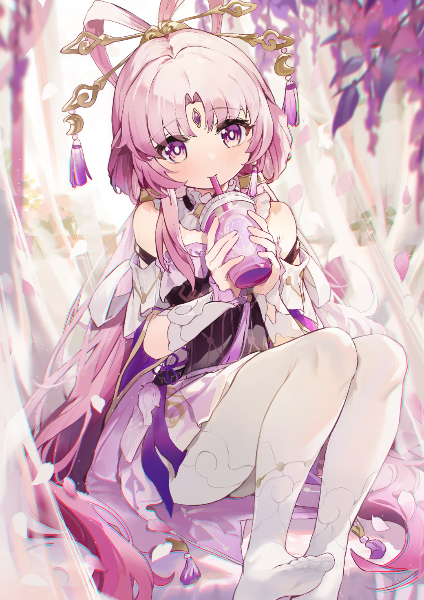
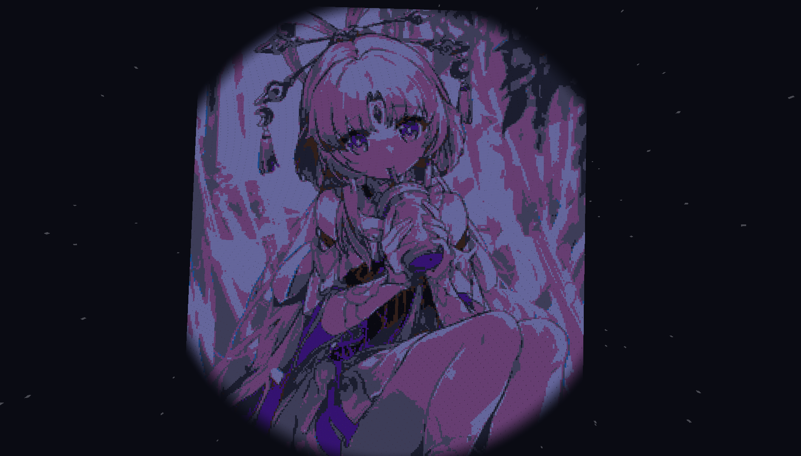

# Painting-the-World: Minecraft 像素图片生成器


## 简介

`Painting-the-World` 是一款我的世界小工具，旨在将数字化的图片转化为《我的世界》游戏内的像素艺术作品。利用RCON（Remote Console）协议，本项目能够直接与《我的世界》服务器通信，按照用户提供的图像数据，在游戏世界中精准地放置方块，复现图像细节。无论是个人艺术创作、地图美化还是游戏内广告牌设计，`Painting-the-World` 都能为《我的世界》玩家和创作者带来全新的可能性。

## 特性

- **支持多种颜色算法**：可替换多种算法确保每个像素都能在游戏内准确对应一个方块。
- **兼容性广泛**：适用于大多数《我的世界》服务器，只需服务器启用了RCON即可使用。
- **自动化构建**：一旦设置完成，系统自动在指定位置构建图片，无需人工干预。

## 快速开始

### 安装与配置

1. **确保RCON启用**：在你的《我的世界》服务器配置中开启RCON功能，并记录下IP地址、端口和密码。
2. **下载与安装**：从[GitHub仓库](https://github.com/PYmili/Painting-the-World)获取最新版本的`Painting-the-World`。
3. **配置工具**：运行配置向导，输入你的服务器连接信息。

#### 命令行参数详解

为了更好地控制`Painting-the-World`的使用方式，本工具提供了一系列命令行参数，以便于用户根据具体需求定制图片转换过程。以下是详细的参数说明：

```shell
python command.py -h
```

该命令会显示帮助信息，包括所有可用的选项：

- `-f FILE_PATH, --file_path FILE_PATH`：指定要转换的图片文件路径。这是必填项，没有此参数程序无法知道要处理哪个图片。

- `-x BASE_X, --base-x BASE_X`：设定绘画起始的X坐标。这决定了图片在游戏世界中的水平起始位置。

- `-y BASE_Y, --base-y BASE_Y`：设定绘画起始的Y坐标。这决定了图片在游戏世界中的垂直起始位置。

- `-z BASE_Z, --base-z BASE_Z`：设定绘画起始的Z坐标。在三维空间中定位图片的深度起点。

- `-c {rgb,lab,hsv,yiq,ycbcr}, --color-space {rgb,lab,hsv,yiq,ycbcr}`：选择用于颜色匹配的颜色空间。不同的颜色空间会影响方块颜色的选择，从而影响最终的像素艺术效果。

- `--no-save`：如果启用，生成的像素画不会被保存到游戏世界中。这可用于测试不同设置而不改变游戏环境。

- `-d, --delete-generated`：删除已生成的像素画。当需要清理之前的作品或进行迭代更新时非常有用。

- `-g, --generate`：执行生成操作。在提供了所有必要参数后，使用此选项来触发图片到游戏世界的转换过程。

- `-rm RESIZE_MULTIPLE, --resize-multiple RESIZE_MULTIPLE`：允许调整图片缩放比例。这对于适应不同的建筑规模或优化构建时间非常有帮助。
  
- `-cb {wool,concrete}, --color-blocks {wool,concrete}`：可以通过设置像素画主要填充方块，wool羊毛，concrete混凝土
  
- `-iv VERTICAL, --vertical VERTICAL`：是否将图片垂直生成(Fasle, True)

#### 示例用法

假设你想要将本地路径下的`test.jpg`图片转换为游戏中的像素艺术，从坐标`(100, 64, 100)`开始，使用HSV颜色空间，并直接生成到游戏中，可以使用以下命令：

```shell
python command.py -f ./test.jpg -x 100 -y 64 -z 100 -c hsv -g
```

通过对比这两个文件，你可以清晰地看到图片如何被转化成《我的世界》中的方块结构，体验这一工具的魅力所在。

---

以上补充了如何使用命令行参数以及提供了效果预览部分，使得文档更加完整，方便用户快速上手并理解项目功能。

## 技术细节

- **开发语言**：本项目采用Python开发，确保稳定。
- **依赖库**：利用了Minecraft-RCON库进行服务器通信，以及PIL（Python Imaging Library）或其他图像处理库处理图像数据。

## 贡献与支持

我们欢迎所有开发者和爱好者贡献代码、报告问题或提出建议。请访问我们的[GitHub仓库](https://github.com/YourGitHubUsername/Painting-the-World)了解如何参与。

---

## 效果预览

以下是直接引用的图片示例，以便更直观地展示转换效果：

- **原始图片**: 
- **转换后的像素艺术**: 

通过对比原始图片与转换后的像素艺术，您可以领略到`Painting-the-World`工具的强大功能及其在《我的世界》游戏中的应用效果。

---

## 附加演示

此外，为了进一步展示项目能力，还提供了额外的演示图片：

- 
- 
